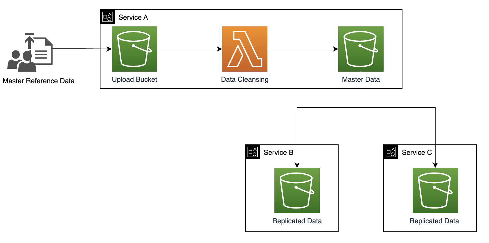
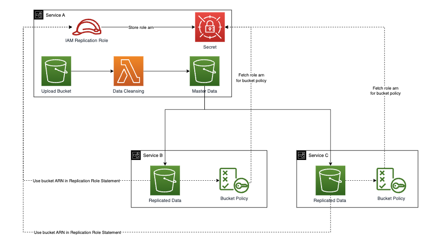

# S3 Replication across services

> There is currently a bug with the CDK using Event Notifications (https://github.com/aws/aws-cdk/issues/5760). See Custom Resource workaround in "service-a-stateless.ts".

This demo can be extended to perform cross-account replicaiton.

However to keep things simple, we deploy 3 services each with their own Cloudformation Stack to demonstrate the replication.

Service A is the master source of the data. Services B and C use the source data with synchronisation with Service A.

Service A will cleanse and validate the data so even if the actor uploads a corrupted copy then it won't break downstream services.



## Replication Role

The Replication role requires the replication buckets (destination buckets) to exist for the ARN to be used in the roles policy statement.

Also each bucket policy on the destination bucket requires the Replication role ARN on their bucket policy.

Therefore we have split the stacks in CDK out to a shared stack which deploys the role and stores its ARN in secrets manager.Then Stack B and C can use the ARN in their bucket policies. Stack A can use the ARN also from secrets manager to update the managed policy once Stack B and C have been deployed.



## Deployment

Run the scripts in order- Pre, Account C, Account B, Account A

```
Scripts:{
        "deploy-pre": "ORG_ID=o-x  cdk deploy --profile primary S3ReplicationDataStackPreReplication",
		"deploy-account-b": "ORG_ID=o-x ROLE_ACCOUNT=xxx ROLE_SECRET=xxx cdk deploy --profile serviceone S3ReplicationDataStackStatefulB --exclusively",
		"deploy-account-c": "ORG_ID=o-x ROLE_ACCOUNT=xxx ROLE_SECRET=xxx cdk deploy --profile servicetwo S3ReplicationDataStackStatefulC --exclusively",
		"deploy-account-a": "ORG_ID=o-x ROLE_ACCOUNT=xxx ROLE_SECRET=xxx SERVICE_B_ACCOUNT=xxx SERVICE_B_BUCKET_SECRET=xxx SERVICE_C_ACCOUNT=xxx SERVICE_C_BUCKET_SECRET=xxx cdk deploy --profile primary S3ReplicationDataStackStatefulA S3ReplicationDataStackStatelessA --exclusively"
}
```

# Welcome to your CDK TypeScript project

This is a blank project for CDK development with TypeScript.

The `cdk.json` file tells the CDK Toolkit how to execute your app.

## Useful commands

- `npm run build` compile typescript to js
- `npm run watch` watch for changes and compile
- `npm run test` perform the jest unit tests
- `cdk deploy` deploy this stack to your default AWS account/region
- `cdk diff` compare deployed stack with current state
- `cdk synth` emits the synthesized CloudFormation template
